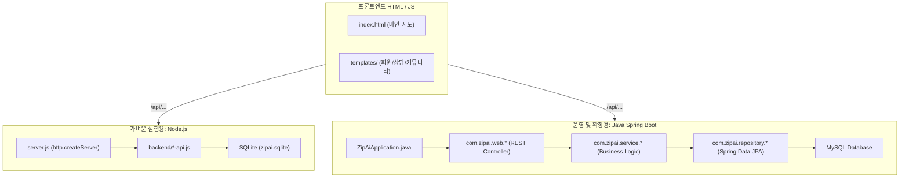

# ZipAI 백엔드 연동 및 기술 설계서 (개발자 분석용)

본 설계서는 **ZipAI (AI 기반 청년 주거 안전 플랫폼)**의 프론트엔드 화면(HTML)과 백엔드 시스템 간의 연동 구조, 사용 언어 및 기술 스택, 그리고 향후 고도화 시 화면별로 추가 적용해야 할 백엔드 기능을 분석하여 정리한 문서입니다.

---

## 1. 백엔드 개발 환경 및 언어 (Backend Stack)

현재 ZipAI는 프로토타입 검증용 **Node.js 서버**와 실제 프로덕션 확장용 **Java Spring Boot 서버**가 공존하도록 구성되어 있습니다.

### 1) 가벼운 실행용: Node.js (JavaScript)
* **언어 및 환경**: JavaScript (ES6+), Node.js
* **특징**: 별도 프레임워크(Express 등) 없이 내장 HTTP 모듈로 경량 웹 서버([server.js](file:///c:/won/git/zipai/server.js))를 구현하여 정적 파일 서빙과 가벼운 API 라우팅을 처리합니다.
* **데이터베이스**: 파일 기반의 SQLite를 사용하며 `node:sqlite` 내장 모듈의 `DatabaseSync`로 처리합니다.

### 2) 운영 및 확장용: Java Spring Boot (Java)
* **언어 및 환경**: Java 21, Spring Boot 3.5.4, Gradle
* **특징**: JPA/Hibernate를 활용한 영속성 레이어 관리, Spring Security 기반의 사용자 인증/인가, Flyway를 이용한 MySQL 마이그레이션을 지원합니다.
* **데이터베이스**: 관계형 데이터베이스인 MySQL을 기반으로 설계되었습니다.

---

## 2. 데이터베이스 테이블 구조 (Database Schema)

| 테이블명 | 용도 | 주요 컬럼 |
| :--- | :--- | :--- |
| **`users`** | 가입 회원 정보 | `id`, `username`, `email`, `phone`, `password_hash`, `password_salt`, `role` (member, agent, admin), `status` |
| **`sessions`** | 사용자 인증 세션 (Node.js용) | `token_hash`, `user_id`, `expires_at`, `created_at`, `last_seen_at` |
| **`properties`** | 중개사 등록 매물 목록 | `id`, `owner_id`, `payload_json` (매물 정보), `status` (pending, approved, rejected, closed) |
| **`favorites`** | 매물 찜(하트) 정보 | `user_id`, `property_id`, `created_at` |
| **`visit_requests`** | 매물 방문 예약 스케줄 | `id`, `requester_id`, `room_id`, `room_title`, `visit_date`, `visit_time`, `phone`, `status` |
| **`room_offers`** | 방 내놓기 제안 내역 | `id`, `owner_id`, `payload_json`, `status` |
| **`community_posts`** | 동네 리뷰 게시글 | `id`, `author_id`, `category` (review, tip, question, free), `title`, `content`, `area`, `rating` |
| **`community_comments`**| 게시글 댓글 | `id`, `post_id`, `author_id`, `content` |
| **`community_post_likes`**| 게시글 추천 | `post_id`, `user_id`, `created_at` |
| **`inquiries`** | 1:1 고객 문의 게시판 | `id`, `user_id`, `category`, `title`, `content`, `status`, `answer` (관리자 답변) |
| **`notifications`** | 실시간 승인 및 알림 데이터 | `id`, `user_id`, `type`, `title`, `message`, `related_type`, `related_id`, `read_at` |

---

## 3. HTML 파일별 백엔드 연동 및 추가 적용 필요 기능 정리

각 화면의 특징에 맞는 **현재 구현 상태**와 **앞으로 추가로 적용해야 할 백엔드 기술 스택 및 비즈니스 로직**을 매핑한 결과입니다.

### 1) [index.html](file:///c:/won/git/zipai/index.html) (메인 매물 검색 및 지도) - 유준서
* **주요 기능**: 네이버 지도 기반 매물 탐색, 보증금/월세 조건별 다중 필터링, 일반/공공임대 탭 분리, 매물 찜 기능.
* **현재 연동 API**:
  * `GET /api/general-properties` (일반 매물 목록 조회)
  * `GET /api/public-housing` (LH 공공임대 API 중계)
  * `GET /PUT /api/favorites` (찜 목록 조회/갱신)
* **앞으로 적용해야 할 백엔드 기술 & 기능**:
  * **적용 언어/기술**: Java (Spring Boot) 또는 Node.js + Spatial Query (공간 쿼리)
  * **추가 적용 내용**:
    1. **공간 인덱싱 (Spatial Indexing) 도입**: MySQL의 `GEOMETRY` 타입과 `SPATIAL INDEX`를 적용해 지도 화면 확대/이동 시 현재 화면 영역 좌표 내의 매물을 0.001초 내에 빠르게 불러올 수 있도록 구현.
    2. **RPA 실거래가 배치 수집**: 국토교통부 실거래가 데이터 오픈 API를 주기적으로 수집하여 주변 적정 시세 가이드를 함께 제공하는 배치 로직 구축.

### 2) [sub3.html](file:///c:/won/git/zipai/sub3.html) (서브3 테스트 페이지)
* **주요 기능**: 레이아웃 서브 로드 테스트 및 공통 헤더/푸터 테스트.
* **현재 연동 API**:
  * `GET /api/auth/me` (로그인 정보 로드)
  * `GET /api/notifications` (실시간 알림 로드)
* **앞으로 적용해야 할 백엔드 기술 & 기능**:
  * **적용 언어/기술**: Java (Spring Boot) 또는 Node.js + SSE (Server-Sent Events)
  * **추가 적용 내용**: 알림 조회 시 매번 클라이언트가 요청하는 폴링 방식 대신, 서버에서 이벤트가 발생하면 즉시 알려주는 SSE 또는 WebSocket 실시간 push 기술을 공통 모듈에 도입.

### 3) [login.html](file:///c:/won/git/zipai/templates/member/login.html) / [signup.html](file:///c:/won/git/zipai/templates/member/signup.html) / [mypage.html](file:///c:/won/git/zipai/templates/member/mypage.html) (회원 서비스) - 송성근
* **주요 기능**: 가입 및 로그인, 내 정보 및 찜 목록, 내가 올린 매물/방문 예약 이력 관리.
* **현재 연동 API**:
  * `POST /api/auth/signup` (가입) / `POST /api/auth/login` (로그인)
  * `GET /api/properties/mine` (본인 등록 매물 리스트 조회)
  * `GET /api/inquiries` (본인 1:1 문의 조회)
* **앞으로 적용해야 할 백엔드 기술 & 기능**:
  * **적용 언어/기술**: Java (Spring Boot / Spring Security) + JWT, OAuth 2.0 (소셜 로그인), Redis (캐시)
  * **추가 적용 내용**:
    1. **소셜 간편 로그인 연동**: 카카오, 네이버, 구글 OAuth2 API 컨트롤러 추가 연동.
    2. **JWT 기반 토큰 인증**: Access Token/Refresh Token 발급 구조로 변경하고, 분산 환경 및 API 게이트웨이 확장에 대비해 Redis에 토큰을 캐싱하여 관리.
    3. **이메일/SMS 본인 인증**: 가입 단계에서 본인 인증을 위한 SMTP 이메일 또는 외부 SMS 발송 API 탑재.

### 4) [charter-rate-calculator.html](file:///c:/won/git/zipai/templates/defense/charter-rate-calculator.html) / [checklist.html](file:///c:/won/git/zipai/templates/defense/checklist.html) / [fraud_result.html](file:///c:/won/git/zipai/templates/defense/fraud_result.html) (사기방지 및 종합 진단) - 송성근
* **주요 기능**: 전세가율 연산, 시기별 계약 안전성 체크리스트 수행, 점수화된 종합 분석 리포트 출력.
* **현재 연동 API**: 현재는 완전히 프론트엔드 자바스크립트의 로컬 연산으로 구동 중. (API 연동 없음)
* **앞으로 적용해야 할 백엔드 기술 & 기능**:
  * **적용 언어/기술**: Python (AI/OCR 처리 서버) + Java (Spring Boot) + Cloud Storage (AWS S3)
  * **추가 적용 내용**:
    1. **등기부등본 OCR 자동 인식 API**: 사용자가 등기부 이미지/PDF 업로드 시 OCR 모델(CLOVA OCR 등)을 경유하여 갑구의 신탁 여부, 을구의 근저당 채권최고액을 자동 파싱해 전세가율 계산기에 세팅하는 Python API 및 게이트웨이 구축.
    2. **진단 이력 영속화 및 공유 API**: 사용자가 자가진단을 완료하면 `POST /api/defense/reports`에 진단 스냅샷을 저장하고, 마이페이지에서 과거 이력을 조회하거나 고유 공유 URL을 생성할 수 있도록 영속화 처리.

### 5) [happy-housing.html](file:///c:/won/git/zipai/templates/board/happy-housing.html) (행복주택 자격 간편진단) - 윤태석
* **주요 기능**: 나이, 소득, 자산 요건 입력을 통한 청년 행복주택 입주 가능 여부 체크.
* **현재 연동 API**: 현재는 클라이언트 단의 조건문 연산으로 구동 중. (API 연동 없음)
* **앞으로 적용해야 할 백엔드 기술 & 기능**:
  * **적용 언어/기술**: Java (Spring Boot) 또는 Node.js + Rule Engine (판정 규칙 엔진)
  * **추가 적용 내용**:
    1. **법정 기준 요건 DB화 및 동적 비교**: 도시근로자 월평균 소득 기준, 주거급여 수급 기준 등 매년 개정되는 룰을 백엔드 DB에서 동적으로 읽어 판정하게 함으로써 유지보수 용이성 확보.
    2. **공고 매칭 알림 서비스**: 사용자가 등록한 소득/자산 정보를 기반으로 입주 가능한 신규 LH 모집 공고가 크롤링되면 회원 알림 테이블 및 SMS로 통보해 주는 푸시 시스템 연동.

### 6) [finance-policy.html](file:///c:/won/git/zipai/templates/board/finance-policy.html) / `trend*.html` (주거 금융 정책) - 김해원
* **주요 기능**: 버팀목 전세 대출, 월세 지원 등의 맞춤 정보 조회 및 상환 금액 실시간 계산.
* **현재 연동 API**: 현재 API 연동 없음.
* **앞으로 적용해야 할 백엔드 기술 & 기능**:
  * **적용 언어/기술**: Java (Spring Boot) 또는 Node.js + CMS 관리 API
  * **추가 적용 내용**:
    1. **정책 정보 관리 CMS**: 금융 정책 조건의 개정에 대응하여 백엔드 관리자 화면에서 실시간 추가/수정/삭제를 수행하고 프론트엔드로 내려주는 서빙 API 설계.
    2. **이자/상환 계획 연산 엔진**: 우대금리 옵션 및 원리금 균등/원금 균등 상환 방식별 납입 스케줄 결과 데이터를 생성하여 PDF로 전송하는 연산 라이브러리 연계.

### 7) [lifestyle-analysis.html](file:///c:/won/git/zipai/templates/ai/lifestyle-analysis.html) (방 구하기/내놓기 및 방문 예약) - 윤태석
* **주요 기능**: 중개사/임대인 대상 방 보기 예약 신청, 내 방 정보 업로드.
* **현재 연동 API**:
  * `GET /api/visits` / `POST /api/visits` (방문 예약 신청 및 조회)
  * `GET /api/room-offers` / `POST /api/room-offers` (내놓은 방 조회 및 등록)
* **앞으로 적용해야 할 백엔드 기술 & 기능**:
  * **적용 언어/기술**: Java (Spring Boot) + Redis (분산 락) + Python (AI 추천 모듈)
  * **추가 적용 내용**:
    1. **예약 중복 방지 동시성 제어**: 인기 있는 방문 예약 타임슬롯에 대한 동시 다발적 요청 시 정합성을 보장하기 위해 DB 비관적 락(Pessimistic Lock) 또는 Redis 분산 락을 설계.
    2. **AI 라이프스타일 추천 엔진**: 사용자가 설문 조사에 답변한 내용(통근 시간, 편의시설, 반려동물 가능 등)을 바탕으로 매물 데이터와 벡터 유사도를 분석하여 유사도가 가장 높은 상위 3개 매물을 챗봇 형태로 추천해주는 알고리즘 API.

### 8) [community.html](file:///c:/won/git/zipai/templates/board/community.html) / [community-detail.html](file:///c:/won/git/zipai/templates/board/community-detail.html) (동네 리뷰 및 커뮤니티) - 김해원
* **주요 기능**: 동네 장단점 공유 게시글 및 댓글 등록, 추천 수 조절.
* **현재 연동 API**:
  * `GET /POST /api/community/posts` (커뮤니티 글 조회 및 작성)
  * `GET /POST /api/community/posts/{id}/comments` (댓글 제어)
  * `PUT /api/community/posts/{id}/like` (게시글 추천)
* **앞으로 적용해야 할 백엔드 기술 & 기능**:
  * **적용 언어/기술**: Java (Spring Boot) 또는 Node.js + Cloud Object Storage (AWS S3)
  * **추가 적용 내용**:
    1. **AWS S3 이미지 업로드**: 커뮤니티 게시물에 방 사진이나 영수증 인증 사진을 첨부하기 위해 파일 업로드 모듈과 이미지 리사이징 배치 추가.
    2. **신고 기반 블라인드 처리**: 사용자 누적 신고 수가 일정 횟수를 넘을 시 게시판에서 즉시 가리고 관리자 검토 대기열로 상태를 전이하는 신고 트랜잭션 설계.

### 9) [admin.html](file:///c:/won/git/zipai/templates/admin/admin.html) (관리자 제어판) - 송성근
* **주요 기능**: 미승인 매물 심사 및 상태 승인/거절, 1:1 문의 답변 등록, 커뮤니티 삭제 관리.
* **현재 연동 API**:
  * `GET /api/admin/properties` / `PATCH /api/admin/properties/{id}/status`
  * `GET /api/admin/inquiries` / `POST /api/admin/inquiries/{id}/answer`
  * `GET /api/admin/community/posts` / `DELETE /api/admin/community/posts/{id}`
  * `PATCH /api/visits/{id}/approve` or `reject`
* **앞으로 적용해야 할 백엔드 기술 & 기능**:
  * **적용 언어/기술**: Java (Spring Boot) 또는 Node.js + Scheduler + Analytics (통계 분석 API)
  * **추가 적용 내용**:
    1. **통계 및 대시보드 API**: 당일 가입한 활성 회원 수, 신규 접수된 문의 건수, 매물 검토 대기 건수 등의 지표를 실시간 통계로 집계하고, 성능 향상을 위해 주기적 캐싱 처리하여 제공하는 대시보드 API 구현.

### 10) [safety.html](file:///c:/won/git/zipai/templates/safe/safety.html) (위험안전도 분석) - 이훈경
* **주요 기능**: 지역 안전, 범죄 주의구간, 여성 밤길, 치안시설, 비상벨, CCTV 등의 데이터를 종합하여 지역별 안전 점수를 지도상에 시각화하고 상세 등급 렌더링.
* **현재 연동 API**: 현재는 지도 핀 및 지역 정보가 프론트엔드 마크업과 모의 데이터로 하드코딩되어 작동 중. (API 연동 없음)
* **앞으로 적용해야 할 백엔드 기술 & 기능**:
  * **적용 언어/기술**: Java (Spring Boot) 또는 Node.js + Public Safety Open API (행정안전부/지자체 공공 API)
  * **추가 적용 내용**:
    1. **위치 주소 검색 및 좌표 변환 API**: 사용자가 주소를 검색창에 입력하면 Naver/Kakao Geocoding API를 경유하여 위도, 경도 좌표를 획득하는 주소 변환 기능 연계 (`GET /api/safe/geocode`).
    2. **치안 안전 데이터 조회 API**: 검색한 좌표 기준 및 설정 반경(500m, 1km 등) 내에 설치된 CCTV, 가로등, 비상벨, 지구대 등의 위치 정보를 DB에서 실시간 조회하여 목록화하는 API 설계 (`GET /api/safe/infrastructure`).
    3. **종합 안전도 평가 알고리즘**: 생활안전지도 정보, 5대 범죄 발생 이력, 치안시설 밀도 등의 빅데이터를 결합해 알고리즘 기반 100점 만점의 청년 주거 안전 등급 점수를 산정하여 리턴하는 스코어링 API 구현 (`GET /api/safe/score`).

